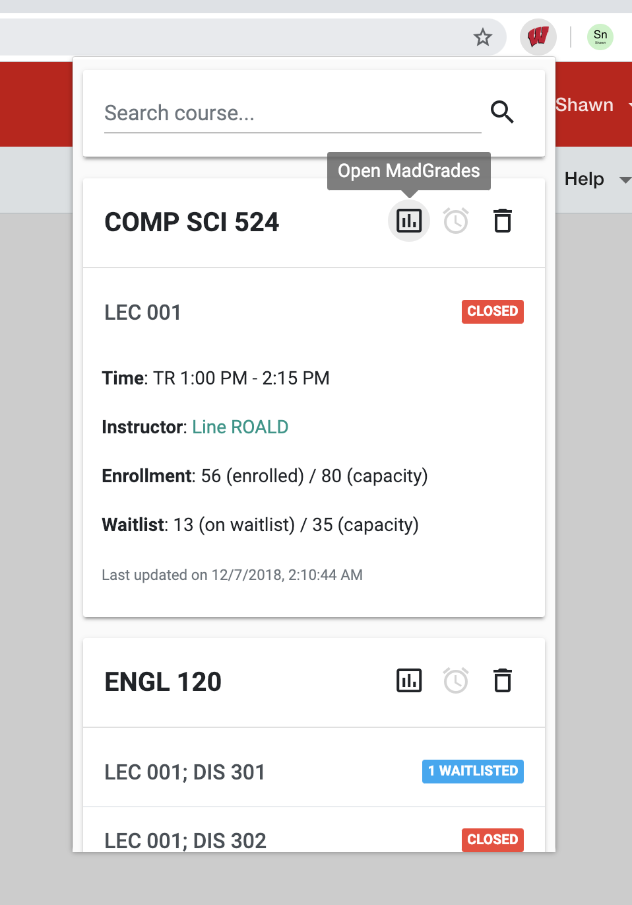

# MadCourse

MadCourse helps UW-Madison students to check the course status on a popup page.

Simply search the course name in the search bar, and select the course you want to keep track of.

Features include: 
* Get alarmed when there is a change in section status (e.g., closed to waitlisted)
* Brief section status for each course in the list
    * The number of people on the waitlist for waitlisted section
    * The number of people currently enrolled for open section
* Detailed section information when you clicked on the section title
    * Time, instructor, enrollment and waitlist status
* Quickly search an instructor on RateMyProfessor.com
* Quickly check the grade distributions and average GPAs on MadGrades.com

